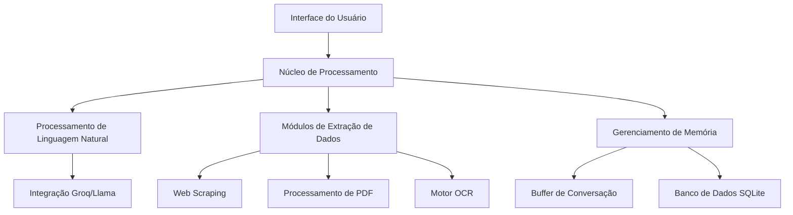

# CityBot - Assistente Inteligente Multimodal


[](https://opensource.org/licenses/MIT)

CityBot é um assistente de inteligência artificial desenvolvido em Python que integra múltiplas capacidades de processamento de dados incluindo extração de conteúdo web, análise de documentos e visão computacional.

## Sumário

- [CityBot - Assistente Inteligente Multimodal](#citybot---assistente-inteligente-multimodal)
  - [Sumário](#sumário)
  - [Visão da Arquitetura](#visão-da-arquitetura)
  - [Funcionalidades Principais](#funcionalidades-principais)
    - [Processamento de Linguagem Natural](#processamento-de-linguagem-natural)
    - [Processamento Multimodal de Dados](#processamento-multimodal-de-dados)
    - [Persistência de Dados](#persistência-de-dados)
  - [Instalação e Configuração do Ambiente](#instalação-e-configuração-do-ambiente)
    - [Pré-requisitos](#pré-requisitos)
      - [1. Clone o repositório](#1-clone-o-repositório)
      - [2. Crie e ative um ambiente virtual (recomendado)](#2-crie-e-ative-um-ambiente-virtual-recomendado)
      - [3. Instale as dependências](#3-instale-as-dependências)
      - [4. Instale o Tesseract OCR](#4-instale-o-tesseract-ocr)
      - [5. Configure sua chave de API e modelo de LLM](#5-configure-sua-chave-de-api-e-modelo-de-llm)
      - [6. Execute o CityBot](#6-execute-o-citybot)
    - [Compatibilidade do Sistema](#compatibilidade-do-sistema)
  - [Resumo das Funcionalidades](#resumo-das-funcionalidades)
    - [Conversa Natural com Memória](#conversa-natural-com-memória)
    - [Leitura e Interpretação de Sites](#leitura-e-interpretação-de-sites)
    - [Análise de Vídeos do YouTube](#análise-de-vídeos-do-youtube)
    - [Leitura de PDFs](#leitura-de-pdfs)
    - [OCR de Imagens](#ocr-de-imagens)
    - [Histórico de Conversas](#histórico-de-conversas)
    - [Integração com LangChain + Groq](#integração-com-langchain--groq)
    - [Interface via Terminal com Menu Interativo](#interface-via-terminal-com-menu-interativo)
    - [Suporte a Clipboard (Área de Transferência)](#suporte-a-clipboard-área-de-transferência)

## Visão da Arquitetura



---

## Funcionalidades Principais

### Processamento de Linguagem Natural

- **Motor**: API Groq com modelo Llama
- **Memória**: Buffer de contexto com histórico de 1000000 interações
- **Personalização**: Templates dinâmicos de prompt via `ChatPromptTemplate`
- **Integração**: Suporte a `ConversationBufferWindowMemory` do LangChain

---

### Processamento Multimodal de Dados

| Módulo                 | Tecnologia           | Capacidades                                                                       |
| ----------------------- | -------------------- | --------------------------------------------------------------------------------- |
| **Conteúdo Web** | WebBaseLoader        | Extração de texto completo (incluindo artigos, blogs e páginas institucionais) |
| **Vídeos**       | YoutubeLoader        | Transcrição automática (suporte a múltiplos idiomas)                          |
| **Documentos**    | PyPDFLoader          | Processamento de PDFs com preservação de estrutura (texto multipágina)         |
| **OCR**           | OpenCV + pytesseract | Reconhecimento de texto em imagens (PNG, JPG, PDF escaneados)                     |

### Persistência de Dados

- **Armazenamento**:
  - SQLite com esquema relacional otimizado
  - Tabelas: `users` (preferências) e `conversations` (histórico completo)
- **Recuperação**:
  - Métodos `load_user()` e `load_conversations()` para consulta
  - Timestamp automático em todas as interações

---

## Instalação e Configuração do Ambiente

Para rodar o **CityBot**, siga os passos abaixo para instalar todas as bibliotecas necessárias, configurar seu ambiente e ativar o suporte para OCR, leitura de PDFs, scraping de sites e análise de vídeos do YouTube.

### Pré-requisitos

Antes de começar, certifique-se de que você possui os seguintes itens:

- Python **3.8** ou superior instalado em seu sistema
- Git instalado (opcional, mas útil para clonar repositórios)
- Conexão ativa com a internet
- Conta criada no [site da Groq](https://console.groq.com/home)
- Chave de acesso à [API da Groq](https://console.groq.com/keys)
- Modelo de LLM selecionado a partir da [documentação da Groq](https://console.groq.com/docs/models)

#### 1. Clone o repositório

```bash
git clone https://github.com/felipecidade94/citybot
cd citybot
```

#### 2. Crie e ative um ambiente virtual (recomendado)

```bash
# Linux/macOS
python3 -m venv venv
source venv/bin/activate

# Windows
python -m venv venv
./venv/Scripts/activate
```

#### 3. Instale as dependências

```bash
pip install -r requirements.txt
```

ou instale manualmente

```bash
pip install langchain langchain-community langchain-groq pytesseract opencv-python python-docx pyperclip python-dotenv
```

#### 4. Instale o Tesseract OCR

O Tesseract é uma dependência obrigatória para a funcionalidade de OCR (leitura de texto em imagens).

- **Windows**

1. Baixe o instalador em: [https://github.com/tesseract-ocr/tesseract/releases](https://github.com/tesseract-ocr/tesseract/releases)
2. Durante a instalação, selecione o idioma **Portuguese**.
3. Adicione o caminho do `tesseract.exe` à variável de ambiente `PATH`.

- **Linux (Debian/Ubuntu)**

```bash
sudo apt update
sudo apt install tesseract-ocr tesseract-ocr-por
```

- **macOS (via Homebrew)**

```bash
brew install tesseract
```

#### 5. Configure sua chave de API e modelo de LLM

Crie um arquivo chamado .env na raiz do projeto com o seguinte conteúdo:

```bash
GROQ_API_KEY=sua_chave_api_groq_aqui
GROQ_API_MODEL=nome_do_modelo
```

#### 6. Execute o CityBot

Com tudo pronto, basta rodar o chatbot no terminal:

```bash
python citybot.py
```

---

### Compatibilidade do Sistema

| Sistema Operacional | Status         | Requisitos Adicionais                  |
| ------------------- | -------------- | -------------------------------------- |
| Windows 10/11       | ✔️ Suportado | Adicionar Tesseract ao PATH do sistema |
| Ubuntu 22.04 LTS    | ✔️ Suportado | `sudo apt install tesseract-ocr`     |
| macOS Monterey      | ⚠️ Limitado  | Problemas conhecidos em chips M1/M2    |

**Legenda:**

- ✔️ = Suporte completo
- ⚠️ = Funcionalidade limitada

**Notas Adicionais:**

1. **Windows**: Requer [Tesseract OCR](https://github.com/UB-Mannheim/tesseract/wiki) instalado
2. **Linux**: Pacotes recomendados:

```bash
   sudo apt install libtesseract-dev tesseract-ocr-por
```

3. **macOS:** Para chips Apple Silicon, instale via Homebrew:

```bash
brew install tesseract
brew install tesseract-lang
```

---

## Resumo das Funcionalidades

### Conversa Natural com Memória

O CityBot permite conversas contínuas com um assistente baseado em LLM, mantendo o histórico de mensagens no banco de dados SQLite. Ideal para explorar temas diversos com continuidade e contexto nas respostas.

### Leitura e Interpretação de Sites

Com a funcionalidade de carregamento de sites, o CityBot extrai e interpreta o conteúdo textual de qualquer URL informada. Você pode fazer perguntas diretamente sobre o conteúdo da página.

### Análise de Vídeos do YouTube

Insira a URL de um vídeo do YouTube e o CityBot transcreve e analisa automaticamente o conteúdo falado (em português). É possível realizar perguntas sobre o vídeo como se fosse um artigo ou aula.

### Leitura de PDFs

O CityBot pode carregar documentos PDF diretamente do seu sistema, extrair seu conteúdo textual e responder perguntas com base nessas informações, como um leitor inteligente de documentos.

### OCR de Imagens

Utilizando Tesseract OCR e OpenCV, o CityBot extrai o texto contido em imagens. O conteúdo reconhecido é salvo automaticamente em `.docx` e `.txt` com o nome especificado. Você pode fazer perguntas sobre o texto extraído.

### Histórico de Conversas

Todas as interações com o assistente são armazenadas no banco de dados local (`citybot.db`), permitindo reuso de contexto e análise futura das conversas.

### Integração com LangChain + Groq

O CityBot é construído com LangChain, utilizando o modelo LLaMA 3.3-70B da Groq via API. A arquitetura com `ChatPromptTemplate` e `ConversationBufferWindowMemory` permite diálogos fluidos, com controle de contexto e persistência.

### Interface via Terminal com Menu Interativo

A interface principal é um menu em terminal, onde o usuário pode selecionar opções como conversar, carregar PDFs, vídeos, imagens, ou sites. O controle do fluxo é feito de forma simples e clara.

### Suporte a Clipboard (Área de Transferência)

Detecta automaticamente se o usuário está usando colagem (CTRL+V) para facilitar o envio de trechos longos. Perfeito para interações com textos copiados de outras fontes.
